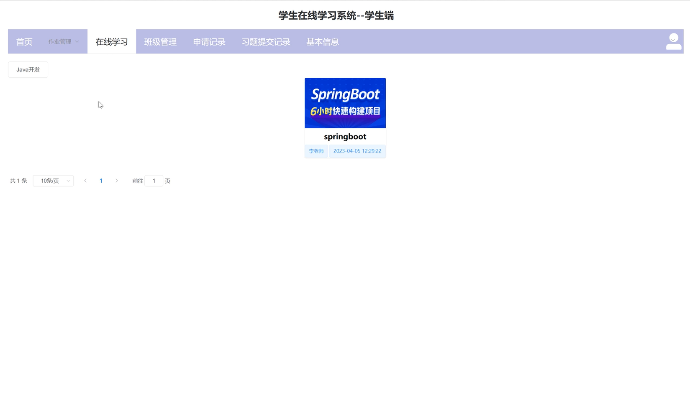
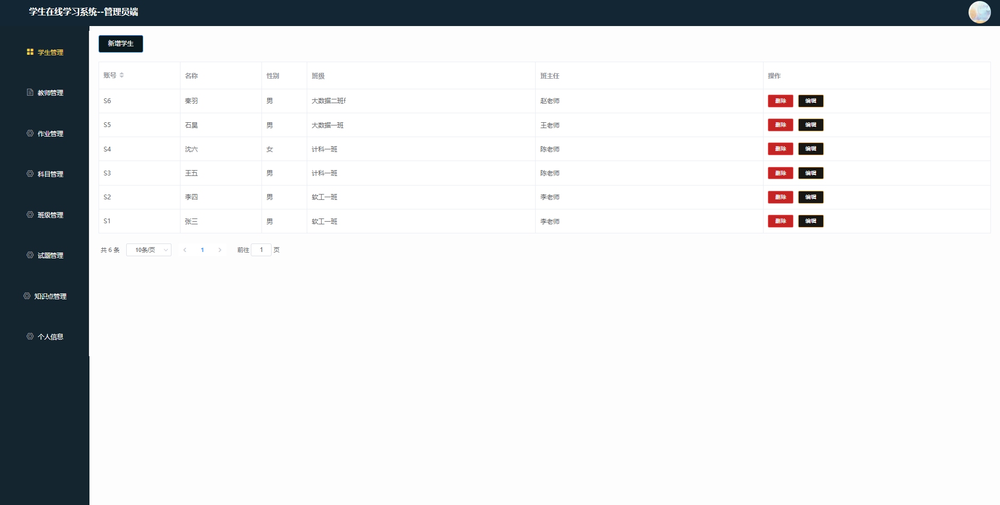

# 在线学习系统

### 9.9￥ 获取完整源码+sql，附赠20000字论文参考，需要加Q：3808981644  或者加微信 ：qszard26
### 有问题，或者需要协助调试运行项目的也可联系
### 获取更多项目，关注公众号：编程项目集

## 一、项目介绍

开发语言：java

运行环境:idea或eclipse vscode 数据库:mysql

后端技术：SpringBoot、Mybatisplus

前端技术：Vue、ElementUI

系统主要功能：系统设计三个角色，学生，教师，管理员

1.管理员：对学生和老师基本信息进行增删改查，管理各个班级的作业，管理全校师生的班级、试题、科目、作业、以及教师发布的知识点等等

管理员功能模块：学生管理、教师管理、作业管理 、科目管理 、班级管理 、试题管理 、知识点管理 、个人信息

2.教师：对自己班级内的学生进行增删改擦、审核学生加入班级的申请、对试题进行增删改查、回答学生的疑问、上传学生学习视频等等

教师功能模块：班级管理、审核待办、试题管理、作业管理、问答社区、知识点补充、视频管理、个人信息

3.学生：查看教师发布的学习视频，完成教师布置的作业，申请加入某个班级等等

学生功能模块：注册、登录、班级管理、审核待办、试题管理、作业管理、问答社区、知识点补充、视频管理、个人信息

## 二、20000字论文参考

## 三、部分功能界面展示

### 学生

### 教师界面

### 管理员界面

### 9.9￥ 获取完整源码+sql，附赠20000字论文参考，需要加Q：3808981644  或者加微信 ：qszard26
### 有问题，或者需要协助调试运行项目的也可联系

